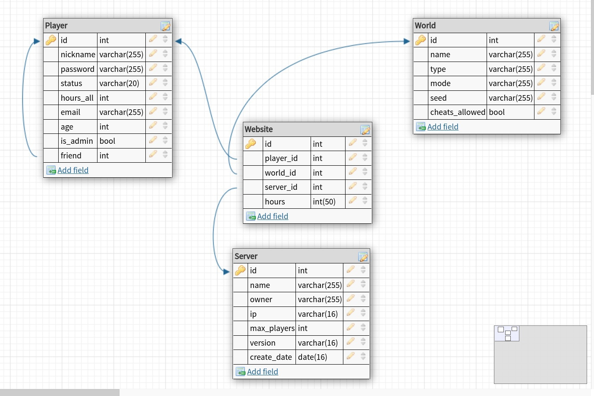

# Базы данных

 [Я в Телеграм](https://t.me/amunra2) 

# Лабораторная работа №1

## Цель

Целью данной работы является создание Базы Данных и заполнение ее данными.

## Ссылки

[ER-диаграмма сущностей Базы данных](./scheme/scheme.jpg)

[Задание на Лабораторную работу](./task/task1.pdf)

[Код](./src)

[Конфигурационный файл подключения к Базе данных через Python](./src/config.py)


## Запуск

0. Установить пакеты `python3`, `python-pip3`, `libpq-dev`

1. Перейти в папку с исходным кодом
   
```bash
cd ./src
```

2. Установить зависмости
   
```bash
pip install -r requirements.txt
```

3. Создать базу данных (советую использовать для работы [DBeaveer](https://dbeaver.io/), [pgAdmin4](https://www.pgadmin.org/), [DataGrip](https://www.jetbrains.com/ru-ru/datagrip/) (бесплатный по студенческой подписке)), заполнив [конфигурационный файл](./src/config.py) Вашими данными.

2. Запустить
   
```bash
python3 main.py
```

## ER-диаграмма сущностей Базы данных




_@amunra2 (2021г.)_
